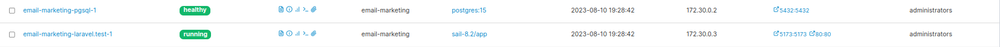

## Email Marketing Tool

## Tools used
- **Laravel 10.1**
- **PHP 8.1**
- **PostgreSQL**
- **CkEditor 4**

## How to:
1- Clone github repository

2- Copy `.env.example` file to `.env`

3- Run `composer install`, then `php artisan key:generate`

4- Run `./vendor/bin/sail up` to setup docker environment along with server and database

To use "sail" instead of "./vendor/bin/sail", go to "~/.bashrc" file and add this:

`alias sail='[ -f sail ] && sh sail || sh vendor/bin/sail'`

Either using portainer to check you containers or through terminal,

You should find the following containers up, running and healthy

5- Go to `.env` file and edit: "DB_HOST = 172.29.0.2"

6- Run `sail artisan migrate:fresh` to migrate tables, then `sail artisan db:seed` to run seeds and get testing data

6- Go to `http://0.0.0.0:80` to access dashboard
